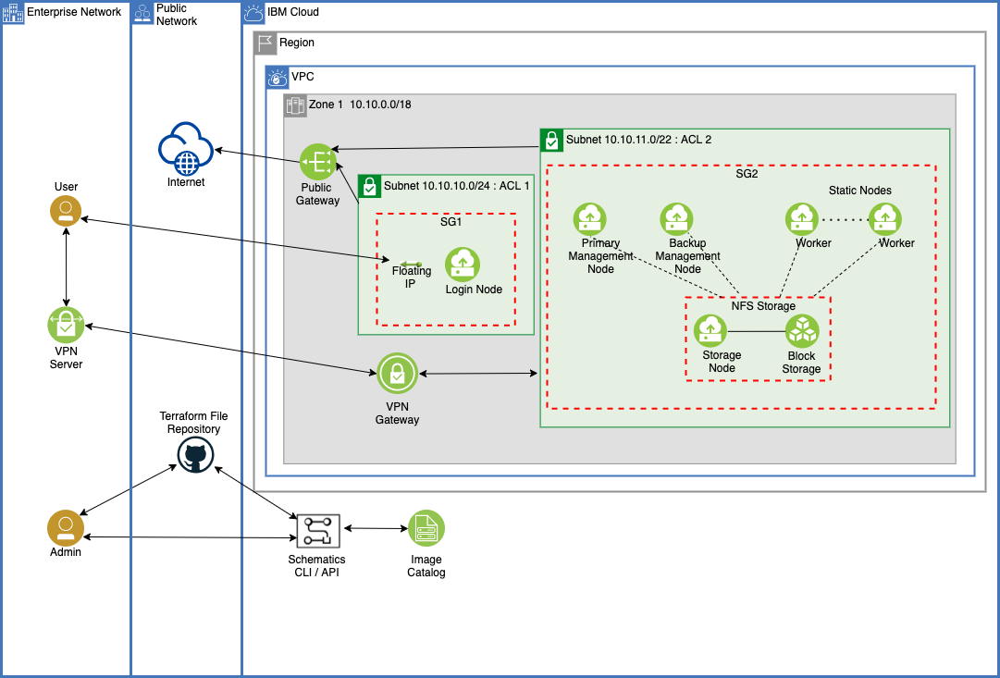

---

copyright:
  years: 2021, 2022
lastupdated: "2022-01-27"

keywords: 

subcollection: hpc-slurm

---

{:shortdesc: .shortdesc}
{:codeblock: .codeblock}
{:screen: .screen}
{:external: target="_blank" .external}
{:pre: .pre}
{:tip: .tip}
{:note .note}
{:important: .important}

# About Slurm
{: #about-slurm}

Slurm on IBM Cloud allows you to deploy high-performance computing (HPC) clusters that use the [Slurm Workload Manager](https://github.com/SchedMD/slurm){: external} as HPC scheduling software. This offering uses open source Terraform-based automation to provision and configure {{site.data.keyword.vpc_short}} resources that make up the cluster. With simple steps to define configuration properties and use automated deployment, you can build your own HPC cluster in minutes by using your choice of an Intel x86 based [VPC virtual server instance profile type](/docs/vpc?topic=vpc-profiles&interface=ui) for the worker nodes in the cluster.
{: shortdesc}

Slurm on IBM Cloud supports three interface types for its use: UI, API, and CLI. The UI involves use of [IBM Cloud Schematics](/docs/schematics?topic=schematics-getting-started) workspaces. To use the Schematics API and CLI interfaces, the Terraform-based automation code is available in this [public git repository](https://github.com/IBM-Cloud/hpc-cluster-slurm){: external}.

The offering enables the initial Slurm-based HPC cluster creation. Any updates that are needed post-deployment regarding Slurm configuration or setup should be performed by using Slurm tools and commands. If you use the {{site.data.keyword.bpshort}} interface to make changes to configuration properties and reapply those changes, you can cause disruptions to the running Slurm cluster. Restoring it back to a working state might not be easy.
{: important}

## Architecture diagram
{: #architecture-diagram}

{:caption="Figure 1. Architecture diagram of a Slurm cluster on {{site.data.keyword.cloud_notm}}" caption-side="bottom"}

